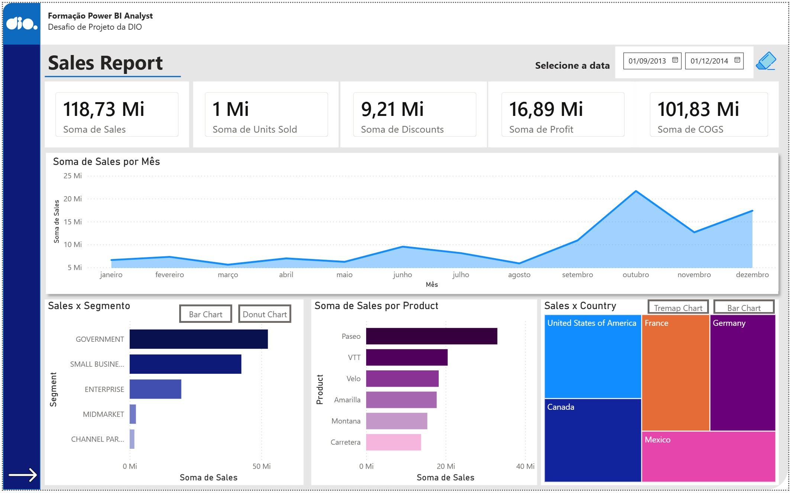
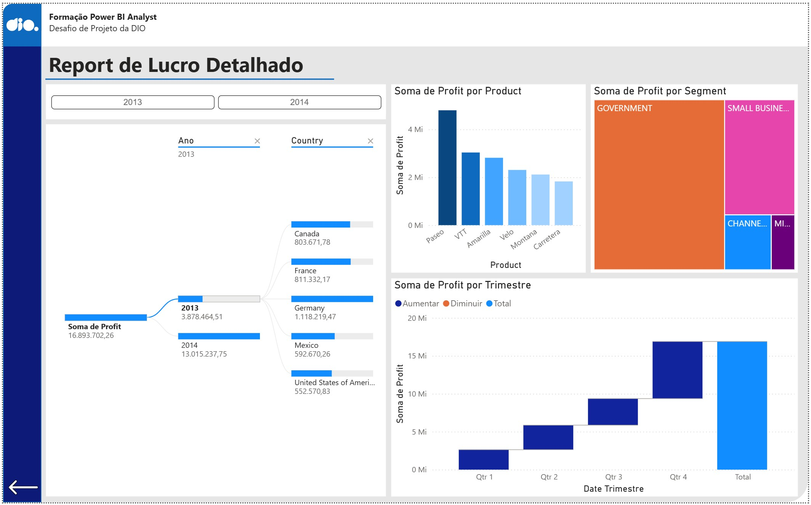

# Desafio Power BI Analyst - Relatório de Vendas e Lucro

Este repositório contém o projeto prático desenvolvido durante a formação **Power BI Analyst** na [DIO](https://www.dio.me/). O objetivo foi criar um relatório dinâmico e interativo utilizando a base de dados `Financial Sample`.

## 📊 Visão Geral do Projeto
O relatório foi dividido em duas páginas principais para facilitar a análise de métricas de performance de vendas e detalhamento de margens de lucro.

### 1. Sales Report (Relatório de Vendas)
Focado em KPIs macro e volume de vendas.
* **KPIs principais:** Total de Vendas ($118.73 Mi), Unidades Vendidas (1 Mi), Descontos, Lucro e COGS.
* **Gráfico de Área:** Evolução das vendas ao longo dos meses.
* **Análise por Segmento:** Distribuição de vendas entre Governo, Pequenas Empresas e Enterprise.
* **Distribuição Geográfica:** Treemap comparando o desempenho por país (USA, França, Alemanha, etc).

### 2. Report de Lucro Detalhado
Focado na saúde financeira e sazonalidade.
* **Árvore de Decomposição:** Análise do lucro por ano e país.
* **Gráfico de Cascada (Waterfall):** Visualização do lucro por trimestre, destacando o crescimento acumulado.
* **Comparativo de Produtos:** Ranking dos produtos mais lucrativos (Paseo, VTT, Amarilla).

## 🛠️ Recursos Utilizados
* **Layout Moderno:** Uso de formas e containers para agrupar visuais relacionados.
* **Navegabilidade:** Botões de navegação personalizados para alternar entre as páginas.
* **Interatividade:** Segmentadores de dados (Slicers) por data e botões de troca de visual (Bar Chart vs. Donut Chart).
* **Dax Básica:** Soma de vendas, lucros e métricas essenciais.

## 📸 Screenshots

## 🚀 Como visualizar
1. [Clique aqui para baixar o projeto (.pbix)]([https://github.com/cleversonrocha/desafio_dio_power_bi_analyst/blob/main/projeto_sample_financials.pbix?raw=true])
2. Abra no **Power BI Desktop**.
